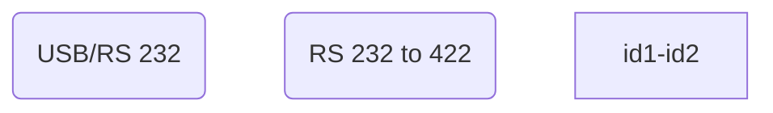

# Wind Tunnel Layout

Shown below is the control and instrumentation for the Gaster tunnel. Visible is the three-axis hot-wire traverse, the data acquisition hardware, and the additional instrumentation and measurement hardware such as filters and oscilloscopes.

<figure>

<figurecaption>Gaster Tunnel Layout Overview</figurecaption>
</figure>

The traverse controller houses the necessary hardware to drive the traverse, with control being carried out through an *NI UMI 7774* motor controller, connected to the PC through an *NI PXI-7350* card housed in an *NI PXI 1033* chassis.

The *NI PXI 1033* chassis also houses the card required for data acquisition. The hardware and connection layout can be seen in the figure below. Control of the wind tunnel fan is communicated through a serial USB interface to the wind tunnel controller.

<figure>

<figurecaption>Gaster Tunnel hardware and instrumentation connection layout</figurecaption>
</figure>

# Connections
For the control system to operate all functions correctly, it is important to ensure that any and all hardware is connected through the correct channels. These channels are highlighted below.

